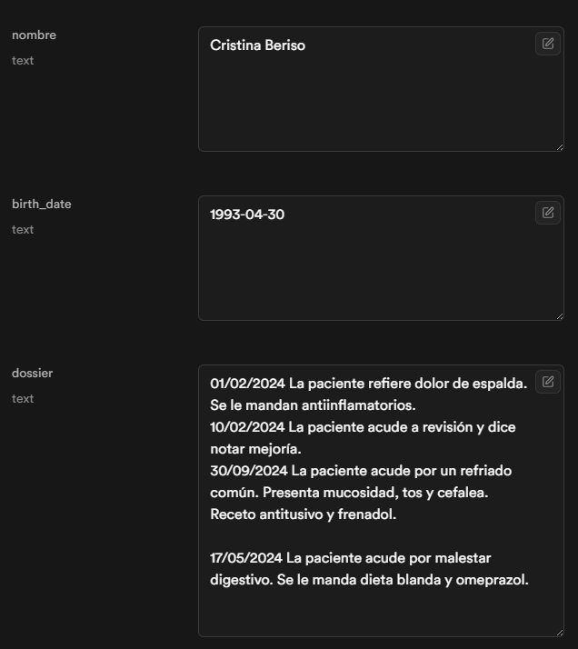

# Bienvenido a la herramienta de gestión de historiales médicos.

## Tecnologías usadas en este proyecto

Gracias a Lovable pude montar un front con Vite, TypeScripyt, React, shadcn-ui y Tailwind CSS.

Además he usado n8n, con implementación de IA y Supabase como base de datos.

## Información

La idea de esta herramienta es poder almacenar información sobre los pacientes con facilidad:

- Crear un historial nuevo de un paciente (siempre que no esté ya creado). P.ej: Crea un paciente llamado Pepe Lopez, nacido el 10 de mayo de 1990.
- Modificar datos del paciente. P.ej: Cambia el nombre de Pepe Lopez por Jose Lopez.
- Añadir o actualizar el historial del paciente. P.ej: El paciente Jose Lopez acude a consulta por dolor abdominal.
- Acceder a un resumen de toda la información relevante del paciente. P.ej: Hazme un resumen del historial de Jose Lopez

## Deploy

Al haber hecho el front por un lado y la api por otro con n8n, he tenido que recurrir ngrok para poder conectar una y otra, ya que mi webhook incluia "localhost" dentro de la url y esto no permitía que se conectaran bien ambas partes. ngrok lo que hace es generar una url publica que sustituya la parte de mi webhook que ocupa localhost:port.

Ejecutando el comando ngrok http 5678 se genera dicha url publica que hay que pegar en el archivo ChatInterface.tsx en la variable N8N_WEBHOOK_URL (url de ngrok + /webhook/6bf2d3f3-a419-417d-9451-b24a1240266b/chat).

Por lo demás se puede desplegar normal, con npm install para instalar todas las dependencias y npm run dev para lanzar el front y abrirlo en el navegador.

## n8n

Hay una anotación en el n8n y es debido a un nodo set que tuve que poner para poder usar la herramienta desde el front. Si se quisiera usar la herramienta desde el propio n8n, lo que habría que hacer sería quitar ese nodo del flow.

## Base de datos

Esta es la información actual de la base de datos.

